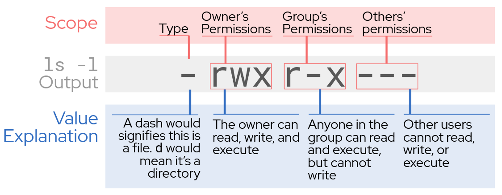

# What are file permissions?

File permissions determine which users can operate on files on a system.
These operations are broken down into three categories:
* Read: Viewing the contents of a file
* Write: Changing the contents of a file
* Execute: Running contents of a file as code

Permissions function differently when applied to directories.
Read allows users to view the contents of a directory, write allows users to
add and delete files, and execute allows users to `cd` into that directory.

>_NOTE:_ There are three more permissions on top of the ones explained
above: setuid, setgid, and sticky bit. These are much less commonly used and therefore
outside of the scope of this lab, but this article on
[Understanding Linux File Permissions](https://www.linux.com/training-tutorials/understanding-linux-file-permissions/)
is a great place to start if you want more information on these additional
permissions.

It is important to properly assign permissions to files and directories
created on a shared system so that files are not accidentally (or maliciously)
tampered with, destroyed, or executed. The next section shows you how to
view the permissions of files in an example directory.

# Displaying files and their permissions

For this lab, several files have been created for you to work with in
the `/srv` directory. Change to it using the `cd` (change directory) command:

`cd /srv`{{execute T1}}

The command `ls -l` can be used to look at the permissions associated with each
file in the directory. The output for this can be cryptic at first, so step will
walk you through what each character means. Take a look at the contents of the
current directory. Use the long listing option (`-l`) to display information
about permissions for each item.

`ls -l`{{execute T1}}

<pre class=file>
drw-r-----. 2 root root  94 Jun  2 21:08 proprietary
-rwxr-x---. 1 root root  66 Jun  2 21:08 status.sh
-rwxr-x---. 1 root root 117 Jun  2 21:08 tasks.txt
</pre>

The first column of the output above is a string conveying the access mode.
The access mode __-rwxr-x---__, seen here for the __status.sh__ file, conveys
the following information:

The middle columns of the `ls` output give information about the user ownership and
group ownership of the files, their size, the time last modified, and finally the
file/directory name itself. The next steps will walk you through the importance
of the file ownership fields.
